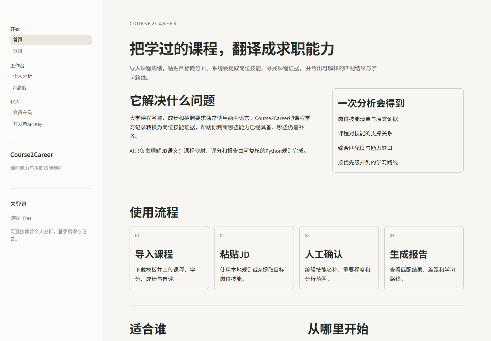

# Course2Career

> 课程能力与求职技能映射助手

[](https://www.python.org/)
[](https://streamlit.io/)
[](LICENSE)
[](https://mhj-course2career.streamlit.app/)

Course2Career 面向大学生，将课程学习记录与目标岗位 JD 转换为可解释的技能匹配结果、能力差距和学习路线。项目采用“AI 提取语义、Python 规则负责评分”的设计，重点展示 AI 应用工程、结构化输出、权限控制和可解释分析能力。

[在线体验 Course2Career](https://mhj-course2career.streamlit.app/)



## 核心能力

- 下载并上传课程 Excel 模板，提供字段、范围和重复值校验。
- 通过本地规则、OpenAI 或 DeepSeek 提取岗位技能。
- 规范化技能并允许用户在分析前人工确认。
- 根据课程证据计算单项技能支撑分和岗位综合匹配分。
- 输出优势、技能缺口、学习路线及 Markdown/CSV 报告。
- 支持游客、普通用户、开发者和管理员权限。
- 支持 AI 日额度、历史分析记录和轻量管理员 Dashboard。
- 开发者 API Key 使用 AES-256-GCM 加密后保存。

## 工作流程

```text
课程 Excel ─┐
            ├─→ 输入校验 → JD 技能提取 → 人工确认 → 课程技能映射
岗位 JD ────┘                                      ↓
                             报告导出 ← 学习路线 ← 匹配评分
```

AI 只参与岗位技能提取。课程映射、评分和学习路线由确定性 Python 逻辑完成，便于测试、解释和复现。

## 技术栈

- Python 3.11+
- Streamlit
- pandas / openpyxl
- Pydantic
- OpenAI Python SDK
- SQLite
- cryptography
- pytest / Ruff

## 快速开始

```powershell
git clone <your-repository-url>
cd course2career
python -m venv .venv
.\.venv\Scripts\Activate.ps1
python -m pip install -r requirements.txt
streamlit run app.py
```

默认可直接使用本地规则模式，不需要模型凭证。

如需启用 AI 或开发者 API Key 模式：

```powershell
Copy-Item .env.example .env
```

随后只在本机 `.env` 中填写所需配置。不要提交 `.env`、数据库或真实密钥。

| 环境变量 | 用途 | 是否必需 |
| --- | --- | --- |
| `OPENAI_API_KEY` | 平台 OpenAI 调用 | 仅 OpenAI 系统模式 |
| `OPENAI_MODEL` | OpenAI 模型名称 | 否 |
| `DEEPSEEK_API_KEY` | 平台 DeepSeek 调用 | 仅 DeepSeek 系统模式 |
| `DEEPSEEK_MODEL` | DeepSeek 模型名称 | 否 |
| `COURSE2CAREER_DATABASE_PATH` | SQLite 数据库路径 | 否 |
| `COURSE2CAREER_KEY_ENCRYPTION_KEY` | 加密开发者 API Key | 开发者模式 |

生成本地加密主密钥：

```powershell
python -c "import base64,secrets; print(base64.urlsafe_b64encode(secrets.token_bytes(32)).decode())"
```

## 开发验证

```powershell
python -m pip install -r requirements-dev.txt
pytest
ruff check .
ruff format --check .
```

测试使用模拟模型响应，不访问真实网络，也不会产生 API 费用。

## 项目结构

```text
course2career/
├── .github/workflows/       # GitHub Actions
├── .streamlit/              # Streamlit 主题配置
├── data/                    # 技能别名、课程映射、学习资源
├── docs/                    # 架构、需求、评分、部署与开发文档
├── examples/                # 脱敏示例 JD
├── prompts/                 # LLM 提示词
├── screenshots/             # README 展示截图
├── src/course2career/       # 业务、数据访问与 UI 模块
├── tests/                   # 单元、集成和 Streamlit UI 测试
├── app.py                   # Streamlit 入口
├── pyproject.toml           # Python 项目配置
├── requirements.txt         # 固定版本的运行依赖
└── requirements-dev.txt     # 测试与代码质量依赖
```

## 设计文档

- [系统架构](docs/architecture.md)
- [MVP 需求](docs/requirements.md)
- [评分设计](docs/scoring.md)
- [AI 评测方案](docs/evaluation.md)
- [权限设计](docs/access-control.md)
- [会员体系](docs/membership.md)
- [管理员 Dashboard](docs/admin-dashboard.md)
- [界面设计](docs/ui-design.md)
- [部署说明](docs/deployment.md)
- [开发规范](docs/development-guide.md)
- [开发日志](docs/development-log.md)

## 数据与安全

- `.env`、SQLite 数据库、日志、缓存和私钥文件均被 Git 忽略。
- 平台 API Key 和加密主密钥只从环境变量读取。
- 开发者 API Key 加密存储，页面和列表只显示末四位。
- AI 模式会把岗位 JD 发送给所选模型供应商，请勿输入个人隐私或招聘方机密。
- 课程信息不会作为模型 Prompt 发送。

公网部署前请先阅读 [部署说明](docs/deployment.md) 和 [安全策略](SECURITY.md)。

## 项目边界

- 匹配结果用于学习规划，不代表招聘录用概率或个人能力认证。
- 课程名称无法完整替代课程大纲、项目作品和实习经历。
- 当前版本使用 SQLite，适合本地和单实例演示。
- 会员页面为权限模型演示，不接入真实支付。

## 参与贡献

贡献流程见 [CONTRIBUTING.md](CONTRIBUTING.md)。安全问题请按照 [SECURITY.md](SECURITY.md) 私密报告。

## License

本项目采用 [MIT License](LICENSE)。
