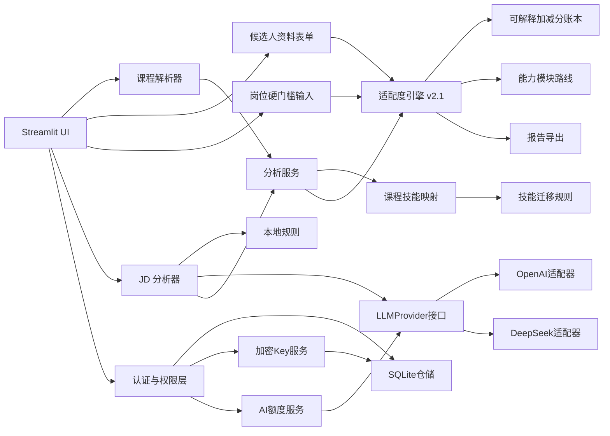

# 系统架构

## 1. 架构选择

项目使用单体Streamlit与`src`布局。`app.py`负责产品外壳、会话身份和动态导航，`ui/`页面负责输入与展示；领域模块负责校验、证据映射、岗位适配度、硬门槛和导出；权限与仓储层负责用户、额度和历史。当前使用SQLite，仓储边界允许后续迁移PostgreSQL。

## 2. 模块职责

| 模块 | 职责 |
|---|---|
| `course_parser.py` | 生成模板、读取 Excel、校验课程 |
| `skill_normalizer.py` | 技能别名标准化和文本识别 |
| `jd_analyzer.py` | JD 边界校验、本地规则提取和客户端编排 |
| `llm_client.py` | OpenAI Responses API 结构化调用与异常转换 |
| `llm_provider.py` | 与供应商无关的模型调用接口 |
| `llm_providers.py` | DeepSeek等供应商适配器 |
| `provider_factory.py` | 根据供应商和系统/用户密钥模式创建客户端 |
| `key_encryption.py` | AES-256-GCM密钥加解密 |
| `api_key_service.py` | 开发者密钥权限、加密和元数据管理 |
| `course_skill_mapper.py` | 课程关键词规则与技能证据生成 |
| `scoring.py` | 保留原有单项技能规则和兼容报告能力 |
| `adaptability.py` | 五维岗位适配度、技能迁移、硬门槛、可信度和解释账本 |
| `learning_path.py` | 保留旧报告的确定性学习步骤 |
| `analysis_service.py` | 保留旧分析报告编排，供兼容路径和测试使用 |
| `report_exporter.py` | Markdown 和 CSV 导出 |
| `models.py` | 跨模块 Pydantic 数据契约 |
| `permissions.py` | 角色、权限和AI日额度策略 |
| `membership_service.py` | 套餐生效边界和管理员人工分配入口 |
| `admin_dashboard.py` | Streamlit管理员概况、成本和用户管理界面 |
| `ui/home_page.py` | 产品介绍和四步使用流程 |
| `ui/auth_page.py` | 登录、注册和账户状态 |
| `ui/analysis_page.py` | 课程、JD、技能确认、报告和历史分析流程 |
| `ui/candidate_profile_form.py` | 教育、项目、实习、潜力、到岗条件和岗位门槛输入 |
| `ui/quota_page.py` | 当前套餐的每日AI额度状态 |
| `ui/membership_page.py` | 套餐对比与不改变权限的升级演示 |
| `ui/developer_page.py` | 开发者API Key保存、更新和删除 |
| `ui/styles.py` | 克制的全局Streamlit视觉样式 |
| `auth_service.py` | 公开注册和登录认证 |
| `access_services.py` | AI额度、历史归属和管理员状态 |
| `user_repository.py` | SQLite用户仓储 |
| `product_repository.py` | SQLite调用记录和分析历史仓储 |

## 3. 关键边界

- 外部模型仅用于结构化提取 JD 语义，不计算分数。
- `jd_analyzer.py`只依赖`LLMProvider`，不依赖OpenAI或DeepSeek实现。
- 内置 JSON 是可版本控制的规则数据，不在运行时被模型修改。
- UI 允许人工修正模型或规则结果，修正后统一进入同一分析服务。
- 岗位适配度不替代硬门槛：学历、专业、毕业年份、到岗时间和城市单独判断。
- 未填写的候选人资料使用中性值并降低可信度，明确选择“目前没有”才视为证据缺失。
- `data/skill_transfer_rules.json`只提供有限迁移证据，不能替代直接项目或实习证据。
- 最终结果由50分基线和逐项加减分组成，解释账本必须与总分对账。
- 外部异常在客户端边界转换为不含敏感细节的业务错误。
- 权限层位于模型调用和历史保存外层，不进入领域分析服务。
- 角色负责安全边界，套餐负责产品能力，敏感操作需要两层权限同时允许。
- 管理员Dashboard只读取聚合指标和脱敏用户字段，不读取密码哈希或API Key密文。
- 开发者API Key以AES-256-GCM密文持久化，主密钥只来自环境变量。
- 页面使用`st.navigation`按角色动态展示入口，页面隐藏不替代服务端权限判断。

## 4. 历史报告恢复

`AnalysisRecordService` 以当前用户 ID 为边界读取已保存的报告快照。`ui/analysis_page.py` 负责将选择的快照恢复到 `st.session_state.analysis_report`；课程上传和 JD 输入仍然只属于当前浏览器会话，不回填到长期存储。

## 5. 后续演进

公开部署前需要继续加强网关级游客限流和管理员角色授予流程。用户量增长后将SQLite仓储替换为PostgreSQL，并考虑增加独立API服务。评分模型若要用于更广泛的人群，需要建立人工标注案例和公平性审查，不能直接使用录用结果训练成“录用概率”。
