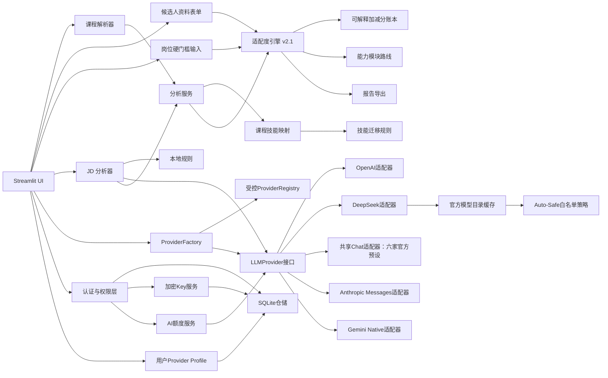

# 系统架构

## 1. 架构选择

项目使用单体Streamlit与`src`布局。`app.py`负责产品外壳、会话身份和动态导航，`ui/`页面负责输入与展示；领域模块负责校验、证据映射、岗位适配度、硬门槛和导出；权限与仓储层负责用户、额度和历史。当前线上 Demo 使用 SQLite；C08-D0 本地分支已加入 PostgreSQL 生产仓储，尚未部署。

## 2. 模块职责

| 模块 | 职责 |
|---|---|
| `course_parser.py` | 生成模板、读取 Excel、校验课程 |
| `skill_normalizer.py` | 技能别名标准化和文本识别 |
| `jd_analyzer.py` | JD 边界校验、本地规则提取和客户端编排 |
| `llm_client.py` | OpenAI Responses API 结构化调用与异常转换 |
| `llm_provider.py` | 与供应商无关的模型调用接口 |
| `llm_providers.py` | DeepSeek 专用路径与六家共享 OpenAI Chat 适配器 |
| `native_providers.py` | Anthropic Messages、Gemini Native 协议适配器 |
| `model_catalog.py` | DeepSeek官方模型发现、缓存、白名单选择与安全回退策略 |
| `model_discovery.py` | C08-C 受控官方模型目录适配、能力/价格归一、用户与端点隔离缓存、过期回退 |
| `provider_factory.py` | 根据供应商和系统/用户密钥模式创建客户端 |
| `provider_registry.py` | 十家不可变官方预设、区域端点 ID、协议和能力策略；不存用户 Key 或动态模型目录 |
| `provider_profile.py` | 当前用户的官方端点 ID、模型 ID 偏好与授权；密钥仍由 APIKeyService 管理 |
| `model_capability.py` | 模型级验证状态与能力边界，未知模型不自动视为 verified |
| `provider_connection.py` | 主动合成 JD 提取的脱敏连接测试契约 |
| `structured_output.py` | 协议级输出策略与 Anthropic/Gemini/百炼 schema 子集 adapter |
| `provider_verification.py`、`provider_validation.py` | gitignored 本机验证记录、模型级状态与固定合成 JD 编排；默认不发网络请求 |
| `provider_error_classification.py` | 仅依据异常类型与 HTTP 状态返回脱敏错误分类 |
| `key_encryption.py` | AES-256-GCM密钥加解密 |
| `api_key_service.py` | 开发者密钥权限、加密和元数据管理 |
| `byok_mode.py` | 登录用户自助开关和读取持久化 BYOK 权限；兼容历史 Developer/Admin |
| `course_skill_mapper.py` | 课程关键词规则与技能证据生成 |
| `scoring.py` | 保留原有单项技能规则和兼容报告能力 |
| `adaptability.py` | 五维岗位适配度、技能迁移、硬门槛、资料完整度和解释账本 |
| `learning_path.py` | 保留旧报告的确定性学习步骤 |
| `analysis_service.py` | 保留旧分析报告编排，供兼容路径和测试使用 |
| `report_exporter.py` | Markdown 和 CSV 导出 |
| `models.py` | 跨模块 Pydantic 数据契约 |
| `permissions.py` | 角色、权限和AI日额度策略 |
| `membership_service.py` | 套餐生效边界和管理员人工分配入口 |
| `admin_dashboard.py` | Streamlit管理员概况、成本和用户管理界面 |
| `ui/home_page.py` | 产品介绍和四步使用流程 |
| `ui/auth_page.py` | 登录、注册和账户状态 |
| `ui/analysis_page.py` | 课程、JD、技能确认、报告和历史分析流程 |
| `ui/candidate_profile_form.py` | 教育、项目、实习、潜力、到岗条件和岗位门槛输入 |
| `ui/quota_page.py` | 当前套餐的每日AI额度状态 |
| `ui/membership_page.py` | Free/Pro 套餐演示及独立的免费开发者模式入口 |
| `ui/developer_page.py` | 启用开发者模式、Provider Hub 和加密 Key 管理 |
| `ui/byok_mode_controls.py` | 账户页和 Provider Hub 共用的模式说明与开关 |
| `ui/styles.py` | 克制的全局Streamlit视觉样式 |
| `auth_service.py` | 公开注册和登录认证 |
| `access_services.py` | AI额度、历史归属和管理员状态 |
| `user_repository.py` | SQLite用户仓储 |
| `product_repository.py` | SQLite调用记录和分析历史仓储 |

## 3. 关键边界

- 外部模型仅用于结构化提取 JD 语义，不计算分数。
- `Role` 表示身份与管理边界，`Plan` 决定平台系统 AI 额度，`user_byok_settings` 独立保存普通用户的 `byok_enabled` 与更新时间。Admin 和历史 Developer Role/Plan 继续拥有 BYOK 权限。Key/Profile/用户 Key 调用在服务层重新读取该设置；关闭模式不删除密文或改变额度。
- `jd_analyzer.py`只依赖`LLMProvider`，不依赖OpenAI或DeepSeek实现。
- 内置 JSON 是可版本控制的规则数据，不在运行时被模型修改。
- UI 允许人工修正模型或规则结果，修正后统一进入同一分析服务。
- 岗位适配度不替代硬门槛：学历、专业、毕业年份、到岗时间和城市单独判断。
- 未填写的候选人资料使用中性值并降低资料完整度，明确选择“目前没有”才视为证据缺失。
- `data/skill_transfer_rules.json`只提供有限迁移证据，不能替代直接项目或实习证据。
- 最终结果由50分基线和逐项加减分组成，解释账本必须与总分对账。
- 外部异常在客户端边界转换为不含敏感细节的业务错误。
- DeepSeek 模型目录属于不可信外部输入，模型 ID 和所有者均需校验；自动选择仅接受历史兼容白名单交集，白名单不代表 B2 当前真实验证状态。
- 模型目录按 Key 的 SHA-256 指纹隔离内存缓存，缓存中不保存 Key；404 模型缺失只允许一次备用模型调用。
- `api_usage.model` 在调用完成时回写供应商实际返回模型，避免目录选择、回退与成本记录不一致。
- 权限层位于模型调用和历史保存外层，不进入领域分析服务。
- 角色负责安全边界，套餐负责产品能力，敏感操作需要两层权限同时允许。
- 管理员Dashboard只读取聚合指标和脱敏用户字段，不读取密码哈希或API Key密文。
- 开发者API Key以AES-256-GCM密文持久化，主密钥只来自环境变量。
- C08-B1 以四类协议路由十家官方预设；OpenAI Responses 和 DeepSeek Auto-Safe 原路径保留，百炼/OpenRouter/SiliconFlow/Moonshot/Zhipu/MiniMax 复用 Chat 适配器，Anthropic/Gemini 用原生协议。所有新增预设只支持用户 Key。SQLite 旧 Key 约束事务化扩到十家，并新增独立 Profile 和费用状态，密文与关联数据不变；详细边界见 [C08 设计](c08-multi-provider-design.md)与[官方矩阵](c08-provider-matrix.md)。
- C08-B2 将候选输出策略与真实验证状态分开：连接测试不升级 VERIFIED；本地忽略文件按 Provider × 端点 ID × 精确模型保存运行证据，C08-D0 后生产仅从受控版本文件读取项目认证。Anthropic 原生 `output_config.format`、Gemini `responseJsonSchema` 与 Qwen strict Chat 请求由小型 schema adapter 支持，原始 JobAnalysis 仍作本地校验。OpenRouter 只有精确模型 metadata 证明支持且完整验证通过时才使用 strict schema。此前两次真实连接均 401，现无 VERIFIED；见 [B2 报告](c08-provider-validation.md)与 [ADR 004](decisions/004-provider-validation-evidence.md)。
- C08-C `ProviderPreset.model_discovery_strategy` 选择动态模型 API 或有来源日期的短静态目录。`ModelCatalogService` 合并官方可用性、能力、价格与独立 B2 记录，拒绝把官方结构化输出升为 `VERIFIED`。内存缓存键含用户、Provider、官方端点、Workspace、Key 更新时间；每次访问复核 B3 开关。DeepSeek 生产 Auto-Safe 目录与开发者候选目录职责不同；旧别名仅提示迁移。[目录说明](c08-model-discovery.md) · [ADR 006](decisions/006-model-catalog-provenance-and-scope.md)。
- 开发者密钥表单通过提交回调完成加密保存；回调结束前删除明文状态并递增表单版本，使前端创建全新的空密码组件，重跑后的页面只读取脱敏元数据。
- 页面使用`st.navigation`按角色动态展示入口，页面隐藏不替代服务端权限判断。
- 页面内容运行在可清空占位容器中；检测到路由变化时先清空旧容器并执行一次受控重跑，规避 Streamlit 页面切换时的内容残留。
- 入口层先按稳定构造参数创建模型工厂，再注入共享模型目录，兼容 Streamlit 热重载期间入口与已缓存模块短暂不同步的窗口。
- 用量服务优先向新版仓储回写供应商实际模型；若热更新窗口中的旧仓储尚不接受 `model` 参数，则仅回退一次旧接口，继续保存状态、Token 与费用。仓储缓存修订号同时递增，完整重跑后恢复新版接口。

## 4. 历史报告恢复

`AnalysisRecordService` 以当前用户 ID 为边界读取已保存的报告快照。历史下拉框以报告 ID 作为内部选项，格式化后的时间、岗位和分数只负责展示，避免同名摘要覆盖记录。`ui/analysis_page.py` 将 v2.1 快照恢复到 `st.session_state.analysis_report`，将旧版 `AnalysisReport` 恢复到独立的 `legacy_analysis_report`，两种报告分别渲染。课程上传和 JD 输入仍然只属于当前浏览器会话，不回填到长期存储。

## 5. 后续演进

GitHub 定时任务每日读取官方目录，发现未知模型时创建一次待验证 Issue，不自动改白名单。公开部署前需要继续加强网关级游客限流和管理员角色授予流程。C08-D0 已在本地分支增加 PostgreSQL 生产路径；独立 CI、备份恢复与发布审查仍待完成。用户量增长后可考虑增加独立API服务。评分模型若要用于更广泛的人群，需要建立人工标注案例和公平性审查，不能直接使用录用结果训练成“录用概率”。

## 6. 招聘 Showcase 静态边界

`showcase/` 是与 Streamlit 应用隔离的 Cloudflare Worker 静态资产部署单元。`wrangler.jsonc` 使用 `assets.directory` 提供 `public/`，`src/worker.js` 只通过 `env.ASSETS.fetch(request)` 返回静态文件并补充安全响应头；它不导入 Python、数据库、Streamlit、模型 SDK 或环境 Secrets。自定义域名 `course2career.tcjyq.cc` 通过 Cloudflare Custom Domain route 绑定到该 Worker。

Showcase 仅承担稳定说明、真实截图和外部链接职责。实际交互仍在 `mhj-course2career.streamlit.app` 完成；该链接可能受 Community Cloud 休眠影响，不能由 Showcase 的流量探测或保活逻辑规避。Streamlit 在无平台模型凭证时动态隐藏系统AI，保持游客本地规则完整路径。

## 2026-09-21 局部扩展

`evidence_display.py`复用技能sources及资格checks统一展示；`SkillMatch.sources`为可选完整来源快照，None表示旧记录未保存来源类型，空列表表示本次未找到证据。原有加权逻辑不依赖标签。

`jd_analyzer.evidence_status`在技能确认表及生成报告时核对当前JD与引用，严格逐字／折叠连续空白，不增加provider调用。技能是否有已知名称或别名明确提及独立检查，不能把规范技能名当原文。报告限制保存生成时核对结论，不新增JD全文持久化。

`demo_cases.py`从公开合成JSON生成合法Excel与输入包，复用分析引擎和报告渲染器。演示结果独立使用demo_result会话键，不保存到账户，也不回填真实输入。LearningModule新增可选task和completion_criteria字段；主路径提供确定性任务，旧路径保持兼容。无数据库迁移或依赖升级。

## C08-D0 数据架构

`database_backend.py` 集中管理 SQLite/psycopg 连接与参数绑定；现有产品仓储方法由 `PostgresProductRepository` 复用。`database_migrations.py` 记录 SQLite 版本 1/2 与 PostgreSQL 新库事务建表；`data_migration.py` 将经过审查的 SQLite 快照全部七张业务表复制到空 PostgreSQL。生产入口必须选择持久后端，失败即停止。生产 VERIFIED 读取随代码版本控制的认证记录，本地验证文件不能提升生产状态。[表清单与限制](c08-production-persistence.md)。
