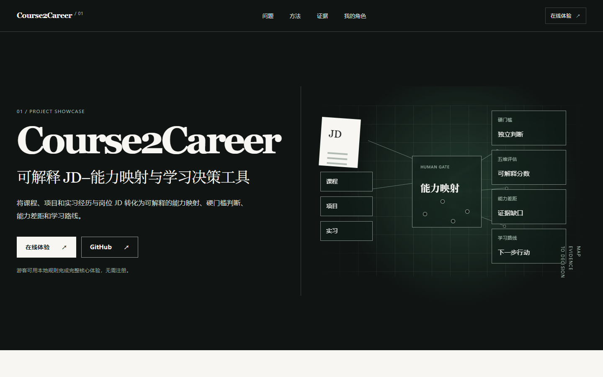
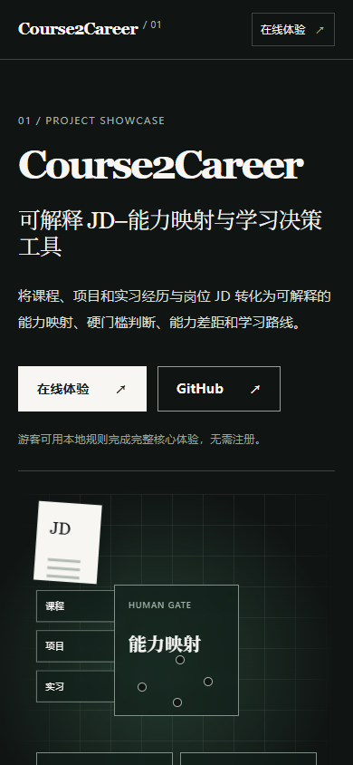
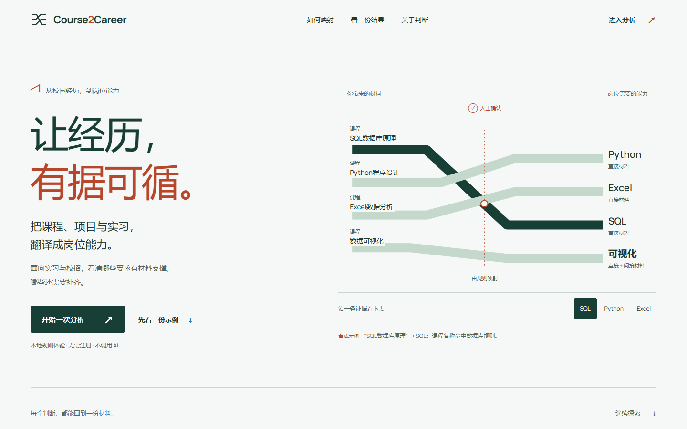
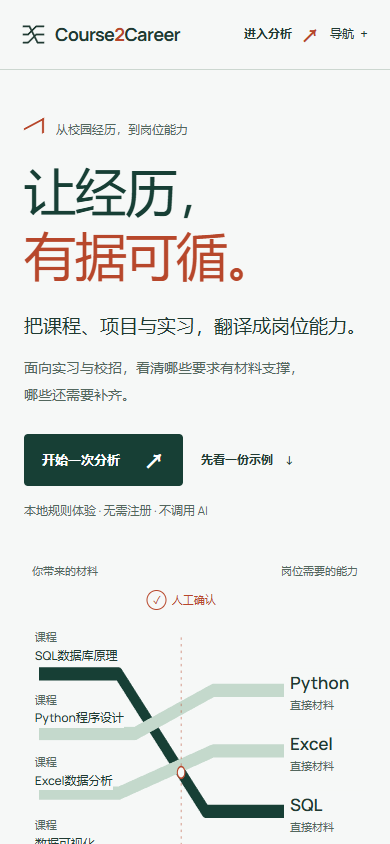

# 首页重构：首版视觉与功能验收

> 历史首版记录，对应 reviewed head `9870c559214914ccd25bf690a8176327c2898403`。后续独立审查发现三个主要视觉问题，并指出 9.0 自评过宽；这里的评分和停止判断不代表当前结论。[PR #9 本轮迭代与同版本对比](homepage-pr9-review-iteration.md)。

日期：2026-10-06（UTC+8）。分支 `design/award-level-homepage`，起点 `82047de0b50e051ca6f3ed4b4088cb17851c5211`。这是未部署的视觉 / 展示候选。参考研究与三个编码前方向见[研究板](homepage-design-research.md)。

## Before / After

Before 是本轮实际打开 `https://course2career.tcjyq.cc/` 的生产截图；After 是本地分支的真实浏览器截图，使用原 Worker 的安全头。以下不是生成的设计稿。

| | Desktop 1440 × 900 | Mobile 390 × 844 |
| --- | --- | --- |
| BEFORE |  |  |
| AFTER |  |  |

[完整桌面](../screenshots/homepage-20261006/after-full.png) · [完整手机](../screenshots/homepage-20261006/after-mobile-full.png) · [768px 平板](../screenshots/homepage-20261006/after-tablet.png) · [实际 Streamlit 首页](../screenshots/home.png)。

## DESIGN_CONCEPT / ORIGINAL_SIGNATURE

“折译轨道”：具体材料穿过人工确认折点，形成能反向追查的岗位技能路径。开口折线同时成为品牌记号、材料图和叙事连接符。深绿色不是概念本身；视觉记忆来自材料之间不同方向的折转、明确的确认位置和可选择的来源。没有复制参考的资产、独有图形、动画、文案或版式。隐藏品牌文字后，课程材料 / 确认折点 / 岗位技能关系仍成立；这是本轮作者自检，不是外部原创性认证。

首页按经历问题 → 确认与转换 → 一份实际规则结果 → 判断边界 → 自己开始排列。核心信息在首屏直接出现：面向实习与校招，将课程与经历翻译为岗位能力。主 CTA 始终是实际分析工具，示例入口为次要动作。

## 迭代与冷评

三次主要设计实施，四轮完整视觉审阅；另两轮截图 / CSP 最终校验。每轮浏览器均检查 1440 / 1280 / 1024 / 768 / 430 / 390 / 360，保存首屏、完整页面、方法、示例、边界和尾部。最终小幅内容校准补充五维权重，便于理解总分；没有改变权重或评分规则。

| 轮次 | 截图批评 | 改进 | 主观评分区间 |
| --- | --- | --- | --- |
| 1 | 首屏有产品意义，但来源字偏小；移动正文密度高；平板图示被压缩。没有假客户或指标，仍需提高可读性。 | 提高正文、来源及报告字号；保持底层路径始终可见，动画仅为沿线信号。 | 7.8–8.7 |
| 2 | 手机改善；平板改为长单列后，上半部空域过大；实际产品截图需要等待 lazy decode。 | 平板单独编排标题 / 操作，图示在下方；实拍 Streamlit 首页并同步静态副本；完整截图先回顶部。 | 8.2–9.0 |
| 3 | 768px 上下结构、桌面左右构图、手机阅读顺序一致，未发现需重组章节或 Hero 的问题。 | 仅校准静态示例完整度、无 JS 控件状态、截图时机。 | 8.6–9.4 |
| 4 | 使用原 Worker CSP 重访全部宽度与交互；没有新结构问题。图、报告、边界和 CTA 各有不同密度，导航完整。 | 最终补足权重说明、应用 caption 对比、证据文件同步。 | 8.6–9.4 |

对模板感的检查：没有重复 section 编号、默认 icon 卡片、渐变文字、玻璃卡、光球、客户墙、假评价或转化数据。唯一编号组是有真实先后顺序的三步流程。其三列为一个流程，不是反复使用的功能卡片。大数只出现在有规则依据的实际报告中，没有 Hero metrics。

对审阅者可能提出的问题：Awwwards 会关注中文字体在不同系统的实际表现与动效完成度；Webby 会关注示例是否误导和操作可达性；FWA 会关注原创性是否来自产品含义。本轮保留明确 Demo 标签、材料边界、可下载输入、原生控件和完整降级，没有用 3D 来遮盖内容。

## TYPOGRAPHY_SYSTEM / COLOR_SYSTEM

展示字体上限 80px，字距不小于 -0.04em；中文用 Microsoft YaHei / PingFang SC 等系统黑体，拉丁与数字用同源 Manrope（24,836 bytes，附 SIL OFL）。H1 / H2 / 说明 / 证据 / 数字 / 操作层级分开；手机正文 14px、具体证据 13px，来源与 metadata 11–12px。没有依赖远程字体服务。

| 语义 | 色值 | 使用 |
| --- | --- | --- |
| BACKGROUND / SURFACE | `#F6F8F7` / `#FFFFFF` | 页面 / 实际报告 |
| PRIMARY / SECONDARY | `#173F35` / `#DCE8E1` | 操作与选中路径 / 材料路径 |
| ACCENT | `#B7472B` | 确认与判断边界 |
| TEXT_PRIMARY / TEXT_SECONDARY | `#203A32` / `#53675E` | 中文主文本 / 说明 |
| BORDER | `#CCD7D0` | 内容分隔 |
| DATA_COLORS | 深绿 / 浅绿，附文字与数字 | 选中来源 / 五维评分，不仅靠颜色 |
| SUCCESS / WARNING / ERROR | `#246B4F` / `#9B3C24` / `#A42E30` | 语义保留；不改应用状态逻辑 |

实算对比度：主文本 11.50:1，辅助文本 5.67:1，浅底强调 4.98:1；深底正文 7.85:1，按钮白字 11.67:1。边界章节的强调只用于大标题，4.49:1 高于大字的 3:1 要求；该章节普通文本为 5.11:1。

## MOTION_SYSTEM / RESPONSIVE_STRATEGY / ACCESSIBILITY

信号沿选中材料线经过确认折点，强调关联关系；只运行一次，底层线不会因动画失效消失。按钮箭头、按压、导航下划线与 details 状态提供反馈。没有满页统一 fade-up、滚动劫持、光标替换或动画库。所有运动有 reduced-motion 替代。

桌面展示并置叙事与材料路径；641–850px 采用专门的标题 / 说明布局，材料图在下方；手机按单列阅读，图示保留全部材料关联。七个指定宽度均无页面横向溢出、无标题容器溢出。移动导航为原生 details，支持 Escape、关闭后焦点返回、锚点点击和点击外部关闭。所有主要目标至少 44px，主 CTA 52–56px。

一个 H1，章节以 H2，报告与具体解释分别分级；跳转主内容、键盘焦点、aria-pressed、原生 meter / details / select 均检查。无 JS 时保留默认完整报告及真实链接，不能切换的控件禁用；同源 JSON 读取失败时显示说明。没有把不可用交互伪装成可点击功能。

## PERFORMANCE

原始结果：[冷加载与对比度](homepage/20261006/performance.json)。每种模式三个新浏览器 context，禁用缓存。移动模式为 390 × 844、150ms 延迟、200,000 bytes/s 下行、CPU 4 倍减速。

| 本地实验 | Desktop | 受限 Mobile |
| --- | --- | --- |
| LCP | 100 / 104 / 228ms | 932 / 940 / 948ms |
| CLS | 0 | 0.000542 |
| 观察到的 interaction event duration | 均低于 16ms 观察阈值 | 16ms |
| 控制台错误 | 0 | 0 |

首屏正文 + CSS + JS + 字体 + JSON + favicon 约 112KB（未压缩）；真实截图约 148KB，延后加载并预留比例。JS 约 5.5KB，无新框架 / Canvas / WebGL / 远程脚本。PerformanceObserver 测量在滚动前取值，避免把之后的截图加载误当初始 LCP。交互样本不代表真实用户 INP；这些不是生产 p75、Lighthouse 分数、CrUX 或线上网络证据。[指标定义](https://web.dev/articles/lcp)、[CLS](https://web.dev/articles/cls)、[INP](https://web.dev/articles/inp)。

## REGRESSION_TESTS

- 最终全量 `pytest`：431 passed / 14 skipped，71.30 秒。保留现有跳过条件，未配置的集成环境不伪报 PASS。
- 最后 JSON / 权重与无 JS 数据更新后，展示回归 5 passed；caption 校准后，应用 AppTest 21 passed。
- `ruff check .`、`ruff format --check .`、`git diff --check`，以及新增 JS 的语法检查通过。
- [展示浏览器](homepage/20261006/showcase-browser.json)：七宽度，9 个交互 / 降级检查，0 外部请求 / 0 页面与控制台错误。
- [原 PR #7 导航安全浏览器](homepage/20261006/navigation-regression.json)：7 组 PASS，18 次普通导航均一轮；游客深链接、认证后的新标签 / F5、跨账号输入隔离、BYOK 开关、双标签登出和无效 token 安全拒绝。
- [应用补充浏览器](homepage/20261006/app-browser.json)使用同一个独立 SQLite 合成夹具：真实首页 CTA、三方向本地规则、登录、Analysis、十家 Developer 展示、390px、登出与 F5，3 组 PASS。外部 HTTP 和浏览器非本地请求禁止；不测试真实 Key 或连接按钮。[登录手机](../screenshots/homepage-20261006/login-mobile.png) · [Provider 手机，合成账号](../screenshots/homepage-20261006/developer-synthetic-mobile.png)。

演示数据读取现有 `data/demo_cases/cases.json`，由同一规则生成：数字化实施 41.2、AI应用 39.8、数据分析 50.3。默认数据分析技术维度 86.8，但毕业年份存在硬门槛；两者分别呈现。当前数据分析无技能缺口，所以不伪造学习任务；其他两个案例从现有实际缺口展示交付物。

## 首版自评（已被后续独立审查推翻，非当前评分）

作者对实际截图与交互的评分，不是独立设计师、真实用户或奖项评委评分。

| Visual | 分数 | Experience | 分数 | Product / Award | 分数 |
| --- | --- | --- | --- | --- | --- |
| TYPOGRAPHY | 9.1 | NAVIGATION | 9.0 | CLARITY | 9.4 |
| WHITESPACE | 9.0 | USABILITY | 9.0 | STORYTELLING | 9.1 |
| COMPOSITION | 9.0 | RESPONSIVE | 9.2 | TRUST | 9.4 |
| VISUAL_HIERARCHY | 9.1 | MOTION | 8.6 | PRODUCT_FIT | 9.4 |
| COLOR | 8.8 | MICRO_INTERACTIONS | 8.8 | CALL_TO_ACTION | 9.0 |
| ART_DIRECTION | 8.7 | ACCESSIBILITY | 8.8 | CREATIVITY | 9.0 |
| DETAIL_CRAFT | 9.0 | PERFORMANCE | 9.1 | ORIGINALITY | 9.0 |
| | | | | MEMORABILITY | 9.0 |
| | | | | INNOVATION | 8.6 |
| | | | | OVERALL_EXPERIENCE | 9.0 |

Awwwards-style 为本轮按官方权重组织的自评：DESIGN 9.0 / USABILITY 8.9 / CREATIVITY 9.0 / CONTENT 9.3，`WEIGHTED_SCORE = 9.00`（40 / 30 / 20 / 10）。弱项是动效的表达范围、系统中文字跨平台形态和艺术指导仍需真人审阅，未写 10/10。

## KNOWN_LIMITATIONS / Run notes

- 只在本机 Chrome 实际验证；Safari / iOS、真实设备、屏幕阅读器完整测试和生产实测未执行。无部署、无生产身份或 Provider 认证结论。
- 合成数据和规则支撑不等于实际用户效果。官网下载字体的许可随资产保存，第三方参考截图只留本机，不再分发。
- 最初 app 批量截图脚本误将 1.60 的 combobox 当文本节点，并引用旧 sidebar testid，产生选择器超时；改用实际 input 值、原生键盘与当前侧栏按钮。此类 harness 失败没有修改业务代码。
- Impeccable CLI detector 已实际运行，唯一 advisory 为数字序列（`01 / 02 / 03`，最终还误纳入权重 `10`），人工核对为真实有序流程与数值。没有设置 ignore。浏览器 mutable injection 可用；overlay 脚本被保留的 Worker CSP 正确阻止，没有绕过或弱化 CSP，未宣称 overlay 成功。工具 live server 已停止。
- 关闭 file watcher 的本地 Streamlit 预览曾保留已导入的旧 CSS 模块；重启独立本地进程后核对 caption 实际颜色为 `rgb(83, 103, 94)`，再重拍截图。没有重启或修改生产。
- 视觉评审和 detector 顺序执行，没有独立 sub-agent 或外部评委；结论仍需人工设计审阅。原始研究、各轮截图、临时 launcher 与完整日志留在本机 gitignored `output/playwright/`。仅提交公开合成证据与筛选截图。
- 只改展示文件、共享 theme / CSS、首页函数、原生入口的一行绑定、展示数据生成 / 回归及配套文档。没有评分 / auth / runtime / quota / 数据库修改。

以下为首版作者当时的停止判断，后续审查已推翻；当前结论以本轮报告为准。在首版本地已测试范围内：`DESKTOP_QA=PASS`、`TABLET_QA=PASS`、`MOBILE_QA=PASS`、`FUNCTIONAL_REGRESSION=PASS`；`BLOCKER_COUNT=0`、`MAJOR_VISUAL_ISSUES=0`。连续最后两轮无值得结构性修改的明显问题，`NO_OBVIOUS_IMPROVEMENT_REMAINING=yes` 表示本轮作者在已测试范围内未发现明确无代价的结构性改善；不表示设计已达到不可改进的客观极限。`READY_FOR_DESIGN_REVIEW=yes`，以 Draft PR 等待人工 review，不 merge / deploy。
