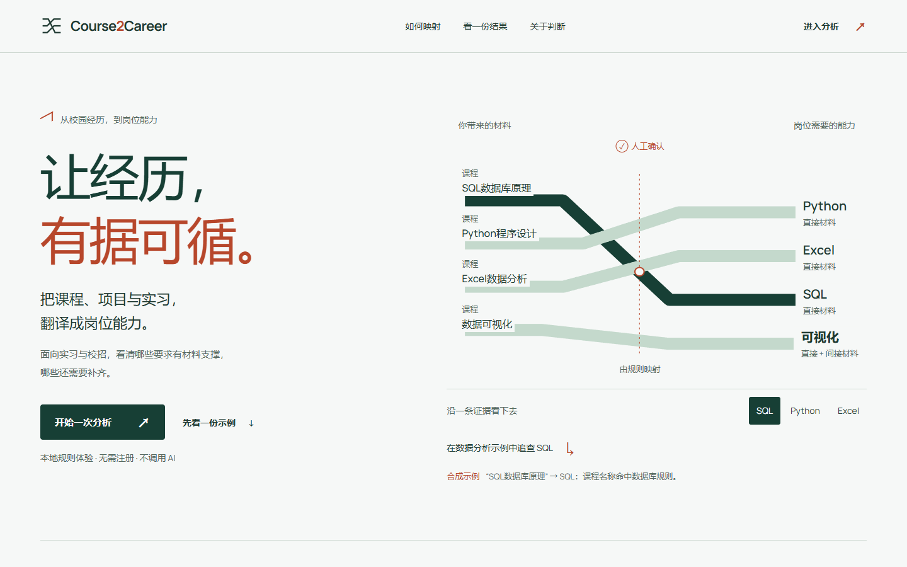
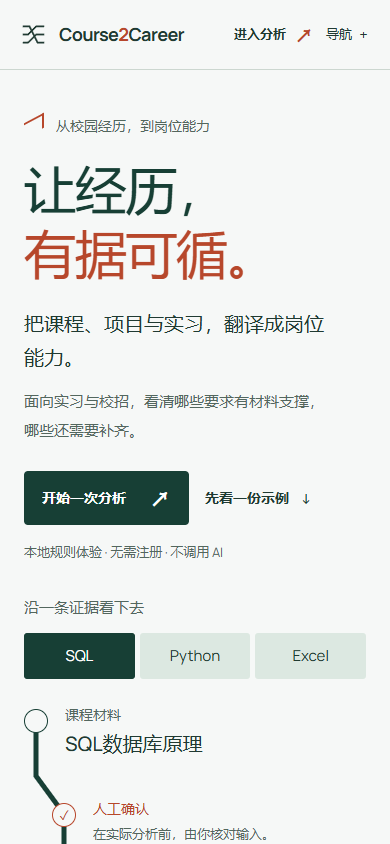
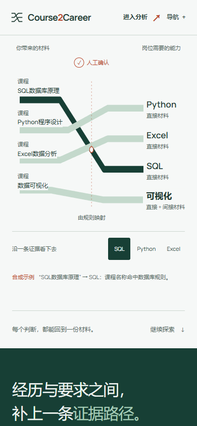
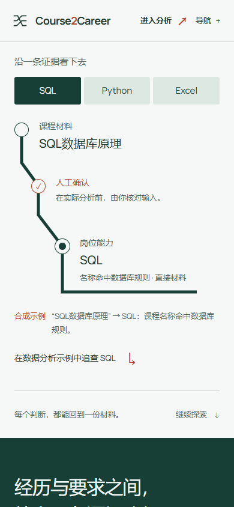
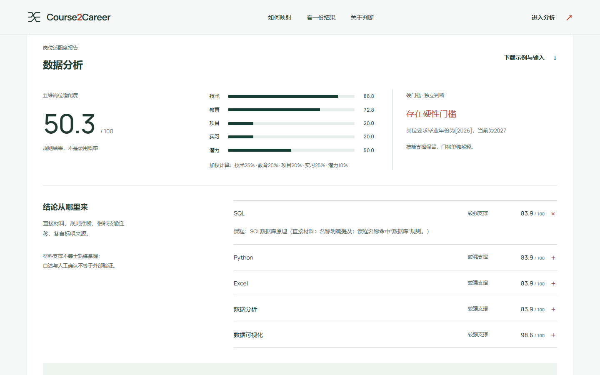
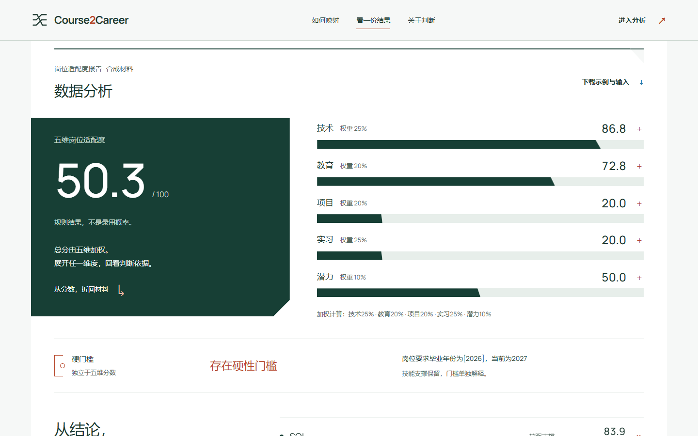

# Draft PR #9：独立审查后的首页迭代

2026-10-06，UTC+8。分支 `design/award-level-homepage`，比较基线为 reviewed head `9870c559214914ccd25bf690a8176327c2898403`。继续同一 [Draft PR #9](https://github.com/tcjyq/mhj-course2career/pull/9)，保留“折译轨道”，没有重开设计方向。

接受独立审查指出的三个主要视觉问题。首版 9.0 自评过宽，已撤回其作为当前验收依据；[首版记录](homepage-design-review.md)保留为历史。这一轮按实际问题、截图和交互验收，不以提高自评分作为停止条件。

## 与 reviewed head 比较

Before 是从该提交重新渲染的本地页面，After 是本轮候选真实 Chrome 页面。两者使用相同 Worker 安全头、字体、合成数据和截图尺度；不是与最初生产首页比较，也不是生成稿。

| 表面 | Before：9870c559 | After：本轮 |
| --- | --- | --- |
| Desktop 1440×900 |  |  |
| Mobile 390×844 |  |  |
| Mobile rail |  |  |
| Report 1440×900 |  |  |

[Desktop full Before](../screenshots/homepage-pr9-review/before-desktop-full.png) / [After](../screenshots/homepage-pr9-review/after-desktop-full.png) · [Mobile full Before](../screenshots/homepage-pr9-review/before-mobile-full.png) / [After](../screenshots/homepage-pr9-review/after-mobile-full.png) · [Tablet 768 Before](../screenshots/homepage-pr9-review/before-tablet.png) / [After](../screenshots/homepage-pr9-review/after-tablet.png) · [Tablet full](../screenshots/homepage-pr9-review/after-tablet-full.png) · [360 Before](../screenshots/homepage-pr9-review/before-360.png) / [After](../screenshots/homepage-pr9-review/after-360.png) · [360 full](../screenshots/homepage-pr9-review/after-360-full.png)。

## 修改与产品含义

手机在 360–430px 不再缩小桌面交叉图。原生有序列表沿一条纵向折转依次呈现课程、人工确认位置和能力；先选 SQL / Python / Excel，再跟随一条来源。课程字号 20px，阶段标签 14px，说明 13px。确认位置是流程示意，文案明确实际分析前由用户核对，不伪装成浏览器自动完成确认。单路径约 300px，比首版 348px 的多路径区域更短；没有依靠增高旧图来解决拥挤。

报告从三块并排的仪表盘改为证据折页：深绿总分截面接续方法段，五维条带可展开既有贡献原因，独立门槛横切五维判断，结论沿反向连接折回材料，最后接到下一步行动。总分 / 原始维度分 / 技能支撑分各有不同字级，不混淆。桌面总分在长解释旁保留参照；手机按顺序阅读，不使用 sticky 总分。没有新增评分、复杂图表或假数据。

技术解释以技能名和实际原因形成可选择的索引，完整来源集中在技能账本，避免在贡献标签、原因和材料三处重复同一段话。教育材料去重显示一次，实际解释条目保留；没有条目时明确未提供。技能名可直达自己的证据行，焦点一起转移；来源含对应课程时可以返回该课程路径。Hero 的追查入口明确指向数据分析示例，当前处在其他案例时会切回对应示例，避免跨案例串读。

## 同一语言的不同变体

| 位置 | 语法 | 用途 |
| --- | --- | --- |
| Hero | 路径在确认位置折转 | 表达材料如何映射到能力 |
| Method → Report | 输出方向与章节交接 | 把过程接到实际结果 |
| Report | 总分截面、条带端部、独立检查点 | 区分加权结果、维度与门槛 |
| Evidence | 来源回转、空心 / 实心节点 | 展开依据，返回已有材料 |
| Trust | 确认 / 门槛 / 返回三个入口 | 可以回到相应判断位置，而非重复画 Logo |
| CTA | 新材料起点与分析入口 | 将示例路径接到个人输入 |
| Footer | 路径返回原点 | 回到第一份材料继续查看 |

不同位置承担不同功能，没有给每章重复贴一根同样的折线。去掉品牌后，路径、开口截面、检查点与返回结构仍有一致的几何关系；这是作者冷审查结论，原创性仍等待人工独立判断。

## 交互、运动与可读性

选中手机技能时，信号按材料 → 确认位置 → 能力的顺序沿固定路径移动。报告切换立即更新真实数值，条带响应新值；维度 / 来源展开从连接处引入上下文。追溯将键盘焦点带到对应技能，返回时带回原选择，不阻塞操作。章节导航显示当前位置，返回 Hero 后清除旧章节标记。

没有增加 fade-up、动画库、远程脚本或用户存储。`prefers-reduced-motion` 保留完整结果与追溯行为，取消 CSS 和 Web Animations；偏好在页面打开期间改变也会终止未结束运动。不能把沿线运动解释为实时 AI 推理或评分。

实际检查 1440 / 1280 / 1024 / 768 / 430 / 390 / 360。关键图示标签、导航、元数据、维度权重、来源、报告脚注与 footer 最小 13px；普通说明主要为 14–15px。手机证据行将状态放在技能名下方，数字与展开操作单独保留空间，避免首版四列挤压。对比度沿用既有品牌；深绿报告正文 7.85:1、白字 11.67:1，普通辅助文本至少 5.11:1。

## 实施与最后两轮审查

本轮四次主要实施，期间持续重新渲染；最后两轮是对最终实现的完整审查，分开于自动测试。

| 实施 | 冷评发现 | 处理 |
| --- | --- | --- |
| 1 | 单路径手机构图明显改善；白底总分 + 横条仍像常规仪表盘，整页连续性不足。 | 推进报告截面、检查点、证据回路和章节交接。 |
| 2 | 深绿截面与方法段连贯；轨道末端过近说明文字；报告分母仍小。 | 保留标签完整，调整终点距离，元数据提升到至少 13px。 |
| 3 | 展开长解释时总分被拉高；当前章节状态在返回 Hero 时残留；贡献文本重复。 | 总分不拉伸，桌面保留参照，修正章节复位，收敛重复文本。 |
| 4 | 精简解释后技能名丢失，失去对应关系；窄屏技能名需要独立空间。 | 补回可追查的技能名，直达具体来源并转移焦点，保留完整材料入口。 |
| 最后完整审查 1 | 七宽度默认整页、方法、报告、边界、尾部；无手机压缩图、断裂、泛化仪表盘、弱运动或过小关键文字的新问题。 | 保留布局；检查 no JS / 读取失败 / reduced-motion。 |
| 最后完整审查 2 | 七宽度默认整页，以及三案例共 21 个展开状态；没有新的上述六类问题。 | 保留实现，补齐截图与原始证据，等待人工设计审查。 |

原始最后两轮位于本机 gitignored `output/playwright/pr9-delivery-review-1/`、`pr9-delivery-review-2/`。筛选的默认和展开截图提交到 `screenshots/homepage-pr9-review/`。[平板展开](../screenshots/homepage-pr9-review/after-tablet-expanded.png) · [手机 AI 案例展开](../screenshots/homepage-pr9-review/after-mobile-expanded.png) · [360 实施案例展开](../screenshots/homepage-pr9-review/after-360-expanded.png) · [键盘 Python 路径](../screenshots/homepage-pr9-review/trace-python.png) / [对应证据](../screenshots/homepage-pr9-review/trace-evidence.png)。

## Award-level cold review

继续使用首轮[参考研究](homepage-design-research.md)，不新增方向或复制案例。

| 参照 | 反问与本轮判断 | 尚需独立审查 |
| --- | --- | --- |
| [Awwwards](https://www.awwwards.com/about-evaluation/) | 报告是否仍像另一个模板？总分截面、条带、门槛与反向来源有共同语言；每章密度和动作不同。 | 艺术指导是否足以达到专业作品水准，不能由作者给自己 9.0 证明。 |
| [Webby 2026/2027](https://www.webbyawards.com/judging-criteria/) | 用户是参与者还是旁观者？现在能改变案例、展开真实维度原因、选中技能来源并返回材料，键盘路径完整。 | 真实用户是否理解这些入口，仍需用户验证；浏览器通过不能替代。 |
| [FWA](https://thefwa.com/FWA25/25.html) | 原创性是否只在 Hero？折转、检查点、返回成为数据与行动的组织方式，没有用装饰或重型技术掩盖内容。 | 记忆点与原创程度需要外部判断，没有宣称 FWA 评分或获奖资格。 |

本轮 Web 抓取 Awwwards Evaluation 再次超时；首轮真实浏览器文本与官方案例的四维分项是已有依据。Webby 当前官方标准已重新核对，FWA 为官方策展质量参照，不虚构固定权重。以上是对照标准的作者冷审查，不冒充新一轮独立评委意见。

## 验证与边界

- 最终本轮全量 `pytest`：431 passed / 14 skipped，65.85s；Ruff check、format check 和 diff check 通过。没有新增依赖或评分逻辑。
- [展示浏览器](homepage/pr9-review/showcase-browser.json)：七宽度，9 组交互 / 降级检查，0 外部请求 / 页面 / 控制台错误。
- [追溯浏览器](homepage/pr9-review/trace-browser.json)：7 组检查，含七宽度可读性、三案例各维度与原始来源一致、跨案例恢复、具体技能入口、键盘焦点、快速切换、章节复位与动态减少动效。
- [展开案例](homepage/pr9-review/expanded-cases.json)：21 状态无横向 / 标题溢出；总分面板不随长解释拉伸。
- [应用回归](homepage/pr9-review/app-browser.json)：3 组通过，含首页原生 CTA、三组本地规则、匿名 / 登录 / Analysis / Developer / 手机 / 登出后 F5。
- [原导航安全回归](homepage/pr9-review/navigation-regression.json)：7 组通过，普通导航单轮、认证恢复、新标签、输入隔离、BYOK 开关、双标签登出与无效 token 拒绝均保留。
- [性能与对比度原始采样](homepage/pr9-review/performance.json)：本轮本地冷加载 Desktop LCP 108 / 116 / 124ms；移动 150ms 延迟、200KB/s 下行、CPU 4 倍减速为 1012 / 1032 / 1072ms，CLS 0.000718。观察到的移动交互事件 duration 16ms，不是实际用户 INP。首屏约 132KB 未压缩，JS 约 12.3KB；真实应用截图继续延后加载，没有动画库。不是生产 p75、CrUX 或 Lighthouse。
- Impeccable detector 只剩真实三步流程 `01 / 02 / 03` 与权重 `10` 的数字序列 advisory；人工核对，不设置 ignore。移除了原本未使用的 stroke-width transition，没有布局尺寸动画。

本轮没有 scoring、auth、Provider、数据库、应用页或生产修改；真实 AI 调用 0。应用回归使用独立本地合成账户，禁止外部 HTTP。当前仍是 Draft，远程 CI 以该 PR 最新提交为准，本地通过不推定远程通过。

只测本机 Chrome，未测 Safari / iOS、真实设备或完整屏幕阅读器。较长的展开解释会增加阅读长度，但它由用户主动打开；默认报告保持紧凑。最初 Before 捕获脚本引用新版本才有的 `#evidence-ledger`，已改为两个版本共有的 class，成功重拍；这是采集脚本修正。第三方参考资产没有加入产品。

在已测试范围内，最后两轮作者完整审查未发现需要继续处理的指定六类问题：`BLOCKER_COUNT=0`、`MAJOR_VISUAL_ISSUES=0`、`NO_OBVIOUS_IMPROVEMENT_REMAINING=yes`、`READY_FOR_DESIGN_REVIEW=yes`。这不表示人工独立审查已通过，也不等于 `READY_TO_MERGE`。继续等待人工审查，不 merge / deploy。
