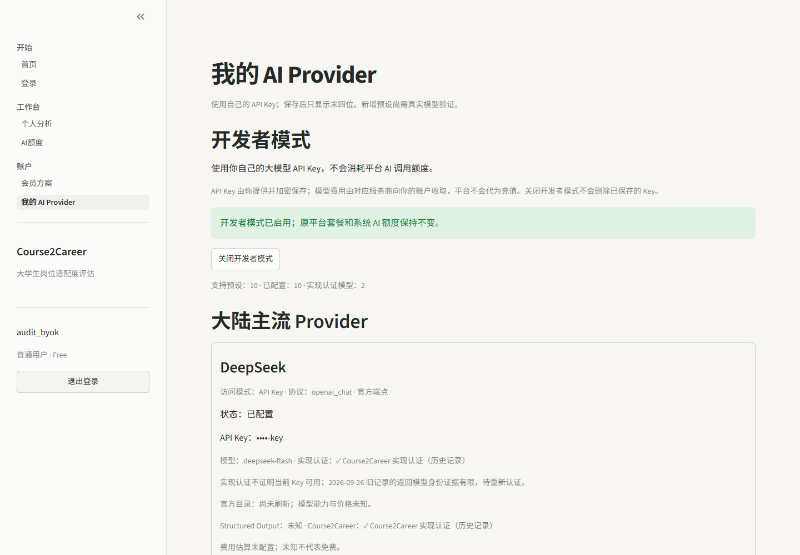
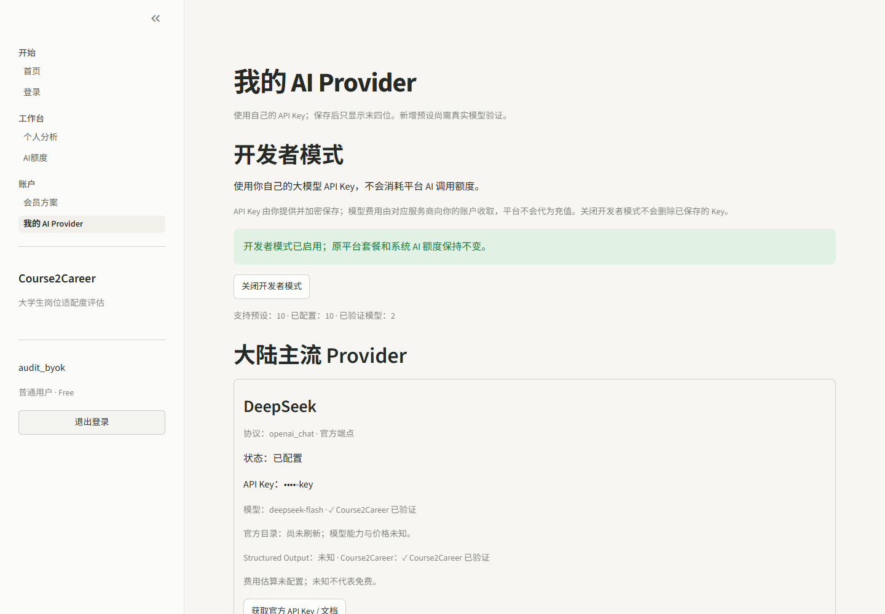

# 界面与产品体验

## 折译轨道（2026-10-06 视觉候选，未部署）

公开首页使用“材料 → 确认 → 规则 → 结果”的原创折线语言。中性浅底支撑中文证据阅读，深绿承接品牌、朱橙标出确认与边界；同一折线形状用于品牌记号和有意义的材料路径。Hero、方法、实际合成结果、可信边界与开始体验形成完整阅读节奏，不平铺同尺寸功能卡片。

桌面采用开放式文字与证据图；641–850px 将标题 / 操作独立编排在上方，路径在下方；手机用单列、保留完整关联与真实交互。仅选中路径的信号运动一次，底层证据线始终可见；按钮、导航与 details 有反馈。所有运动支持 reduced-motion。Manrope 拉丁字体同源托管，中文采用系统黑体，展示字距不低于 -0.04em，正文与证据分层。语义色、字号、对比度与逐轮截图见[验收报告](homepage-design-review.md)。

## Provider 身份和认证文案（2026-10-05 候选）

在原有卡片内最小补充 API Key 访问模式、实现认证标签、按真实证据版本区分 v0 旧格式限制和 v1 精确认证，以及个人凭证最近测试。最近测试绑定 Key 更新版本，轮换后旧状态不再显示；不添加未实施的 Plan/OAuth 选择器。UNKNOWN/MISMATCH 可保留 Schema 兼容，不能显示新的精确认证通过。测试连接的成功提示明确区分请求模型与 RETURNED_MODEL，六层证据按本次操作展示；静态历史 badge 与用户 Key 状态分开。

以下是隔离本机的合成 BYOK 账号，末四位也是假值；未测试真实 Key 或部署生产。



[浏览器回归](provider-access/20261005/security-browser.json) · [完整报告](provider-access-upgrade-20261005.md)。

## 2026-10-04 性能候选 UI 一致性（未部署）

保留页面结构、文字、十家 Provider 卡片和三例合成演示。路由 / 身份 epoch 绑定内容容器，普通导航一轮且旧首页 / 分析表单不残留；退出清除分析及 Provider 输入。认证 / 存储握手仍使用现有加载界面。[浏览器结果](performance/20261004/security-browser.json)与[完整报告](performance-fix-20261004.md)。

以下是隔离本地合成 BYOK 账号最终页面，假 Key 只显示末四位；不表示真实 Provider 已通过认证或该候选已上线。



## C08-E1 注册过渡与错误文案

公开注册页仅在浏览器标识就绪、Turnstile 挑战通过且服务端已配置时允许提交。等待时提示“请稍候，完成页面验证后即可创建账户。”；暂不可用时说明可继续使用本地规则；达到成功注册窗口时只提示“当前设备近期创建的账户较多，请稍后再试。”，不暴露阈值或哈希。登录、本地规则与已授权 BYOK 仍可用。本地官方测试键环境已检查 390px 挑战宽度与表单可操作性；真实生产 widget 与注册 smoke 已通过，生产移动端完整回归不由此推定。

本地官方测试键环境的 390px 注册页：[截图](../screenshots/c08-e-registration-mobile.png)。图中的 Cloudflare 测试提示仅来自测试键，不代表生产配置。

## C08 登录状态补充

登录页和侧栏文案保持原样。过渡期间统一显示“正在全力加载…”，不提前显示游客身份；明确无 token 才显示游客。用户已确认生产环境中的 F5、Ctrl+R、新标签页和登出后 F5 均通过。历史截图与历史验证文字只描述当时版本。

## 设计目标

Course2Career 保持单体 Streamlit，不引入 React 或复杂组件库。应用页采用中性浅底、深绿色操作色、细边框与系统黑体；首页负责讲述产品，Analysis / Developer 负责实际操作。

招聘 Showcase 是独立静态表面，位于 `showcase/`，与应用共享绿色品牌、折线语言和清晰层级。它不加载 Streamlit 或 Python；小型同源 JS 仅增强证据路径、示例切换与移动导航，无脚本也保留内容和 CTA。没有 WebGL、远程 JS、自动 Provider 请求或新增 tracking。

## 信息架构

```text
Course2Career
├── 开始
│   ├── 首页
│   └── 登录
├── 工作台
│   ├── 个人分析
│   └── AI额度
├── 账户
│   ├── 会员方案
│   └── 我的 AI Provider
└── 管理
    └── 管理员Dashboard
```

管理员入口只对`admin + Admin`显示。“我的 AI Provider”对所有用户开放导航：游客看到登录提示，未启用的普通用户看到介绍和免费启用按钮，启用后显示 Provider Hub。只有已获 BYOK 权限且已配置 Key 与模型的账户，分析页才显示相应用户 Provider。页面可见性只改善体验，最终权限仍由服务层验证。

## 页面职责

- 首页：岗位适配度定位、原生个人分析入口、材料 / 确认 / 规则报告的三步路径和合成示例说明。
- 登录：登录、注册以及已登录账户状态。
- 个人分析：课程导入、候选人资料、JD技能确认、硬门槛、五维适配度、解释账本和能力路线。
- AI额度：展示今日使用、每日上限、剩余额度和自带Key说明。
- 会员方案：Free/Pro 套餐演示与免费开发者模式入口分开，不创建订单或改变套餐。
- 我的 AI Provider：由注册表生成十家统一卡片；选择受控官方端点与模型 ID，查看 Key 末四位、加密保存、更新、删除及主动连接测试。展示“支持／已配置／已验证模型”不同计数。
- 密钥保存成功或校验失败后均更换密码组件标识并渲染全新空输入框，完整密钥不进入后续页面渲染。
- 管理员Dashboard：系统概况、AI成本、DeepSeek模型目录状态和用户套餐管理。

## 交互原则

- 每页只保留一个主要任务。
- 使用有边框容器分隔流程，不依赖颜色表达状态。
- 表单提交后显示明确成功或错误信息。
- 空记录、无Key、未登录和无权限都有可读状态。
- 本地规则模式始终可用，并明确不消耗AI额度。
- 平台没有已启用的模型凭证时，不显示“系统AI”；游客看到本地规则为默认的完整体验路径。
- 导航和身份状态在所有页面保持一致。
- “暂未填写”和“目前没有”使用明确选项，不允许系统擅自补全个人经历。
- 硬门槛、适配度、资料完整度及其等级并列展示，不合并为录用概率。
- 加减分使用带符号数值和文字原因，不只依赖颜色表达好坏。
- 学习建议按缺口优先级列出至多 8 项任务，每项提供交付物和验收标准；无缺口不强行生成任务。
- DeepSeek Auto-Safe 在分析页展示优先顺序，在管理员页提供缓存状态和手动刷新；任何页面都不展示 API Key。
- C08-B1 开发者页展示十家受控官方预设；C08-B3 让普通登录用户通过独立开关进入 Provider Hub，不改变套餐。分析页仅在获得 BYOK 权限且已保存 Key 和模型 ID 时显示“开发者API Key”，并只列该账户已配置的 Provider。未验证模型显示明确提示；免费套餐系统AI只显示 DeepSeek。预设可配置不等于真实模型验证通过；不提供任意自定义端点输入。
- C08-B2 卡片保持单行状态说明：未配置／已配置、连接后“API 可连接”、单次 JobAnalysis 成功后“Schema 兼容”、完整固定集通过后才显示“✓ Course2Career 已验证”。模型状态按端点和精确 ID 隔离；连接失败仅显示脱敏错误，不删除 Key。逐题诊断只在本机忽略文件记录，不增加界面元素或截图；仅 Bailian `qwen3.8-flash`（北京端点）与 DeepSeek `deepseek-flash`（global 端点）已获精确认证。B1 的未配置截图只记录当时的合成状态，不代表当前线上状态。
- C08-B1 的 [390px 本地浏览器截图](../screenshots/c08-b1-developer-mobile.png) 使用隔离假账号与未配置卡片状态；截图不包含真实密钥。截图只证明该视口的页面排版，不替代真人审阅或真实供应商验证。
- C08-B3 的 [390px 开发者模式截图](../screenshots/c08-b3-developer-mobile.png) 使用隔离账号及假 Key，展示普通 Free 用户启用后的 Hub 和脱敏末四位；该视口 `scrollWidth=390`，没有整体横向溢出。截图产生时尚无持久登录；当前 F5/新标签恢复已通过生产 smoke，但本修复分支的跨标签撤销与身份敏感输入清理仍需合并后验收。
- C08-C Provider Hub 将大陆六家放在首组、国际四家放在折叠区。卡片呈现目录数量与上次成功时间、官方 Structured Output、Course2Career 验证、上下文及可核实价格；手动刷新失败标过期，不隐藏已有模型。百炼业务空间 ID 仅用于对应区域官方目录。分析页优先排序大陆已验证／官方能力合格／未验证模型，UNKNOWN 明示风险，UNSUPPORTED 默认不列出；仍允许用户在明确警告下尝试未验证模型。[目录细节](c08-model-discovery.md)。
- C08-C 的 [390px Provider Hub 截图](../screenshots/c08-c-developer-mobile.png) 与 [Kimi 目录卡片截图](../screenshots/c08-c-kimi-mobile.png) 使用隔离假账号和假 Key；浏览器测得 `scrollWidth=innerWidth=390`，可见目录状态、脱敏末四位、价格和模型选择。截图不是实际 API 兼容性证据。
- 页面切换必须清除上一页内容；真实浏览器回归需覆盖“首页 → 个人分析”且确认首页流程区不再显示。

## 历史报告交互

“个人分析”页面底部仅在登录后显示“最近分析”。用户可选择一份历史记录并点击“重新打开这份报告”；选择器以报告 ID 区分记录，并显示短 ID，时间、岗位和分数相同也能区分且不会相互覆盖。恢复后报告回到结果区域，并显示不会回填课程文件和 JD 的说明。旧版报告使用单独标题、旧版综合分和导出按钮，不展示其不存在的五维字段。

## 视觉规则

- 画布：中性浅底 `#F6F8F7`；辅助表面 `#E5EEE7`。
- 主文字：`#203A32`；辅助文字 `#53675E`。
- 主操作色：深绿 `#173F35`；确认与边界强调 `#B7472B`。
- 分隔线：`#CCD7D0`。
- 卡片最大圆角8px，不使用重阴影和渐变。
- 应用标题与正文使用系统黑体；Showcase 拉丁标题与数字采用同源 Manrope，中文采用系统黑体。

主题基础变量位于`.streamlit/config.toml`，少量布局样式位于`ui/styles.py`。

Showcase 的应用截图必须来自真实浏览器，与 `screenshots/home.png` 保持一致；更新 UI 后重新实拍，不生成伪界面。原创材料示意与合成报告明确标记 Demo。外部体验链接在新标签页打开，保持可见焦点；手机按内容重排，保留材料路径和完整导航。

## 测试

- 页面组件通过Streamlit AppTest分别验证。
- 首页验证默认落点和信息层级。
- 个人分析验证Excel导入、错误状态、候选人资料、技能迁移、硬门槛、完整本地分析、v2.1历史恢复、旧版报告兼容和重复摘要记录。
- 登录、额度、会员、开发者和管理员页面均有渲染测试。
- Streamlit真实服务健康检查必须返回`ok`。
- 真实浏览器回归应覆盖一次模型结果返回后的用量回写；热更新兼容分支不得触发第二次模型请求或阻断技能确认区展示。

## 2026-09-21 信息展示调整

保持既有页面和视觉。个人分析顶部增加默认折叠的三方向合成演示；明显展示合成标识，运行与重新开始按钮只控制演示结果。结果复用同一组件，下载控件使用独立键，允许演示与用户报告同时存在。

技能确认表增加只读“依据核对”列，原文与规范化命中、待确认推断和无法定位分开。编辑后生成时重新核对，待确认项显式警示。结果四项指标改为岗位适配度、硬门槛、资料完整度、资料完整度等级。技能表显示全部材料与来源，学习项显示任务、交付物和验收标准。历史记录缺失的新字段显示历史未记录，不伪造来源。

## C08-D0 失败与认证状态

生产数据库未配置或不可连接时，入口显示不含 URL、账号、异常原文的安全提示并停止，不显示已保存成功。模型卡片的 VERIFIED 只从版本化项目认证记录读取；个人“测试连接”最多给出当前连接兼容结果。D2 在分析页“提取岗位技能”操作前贴近按钮显示：本地规则不向第三方模型发送 JD；AI 模式会发送 JD 给所选 Provider，BYOK 可能收费，未知费率明确为“费用未知/未配置”。390px 与桌面实测见[候选报告](c08-d2-release-candidate.md)。
